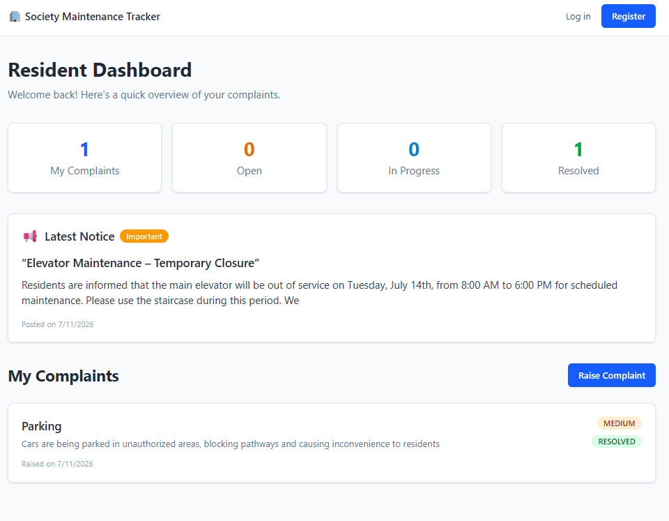
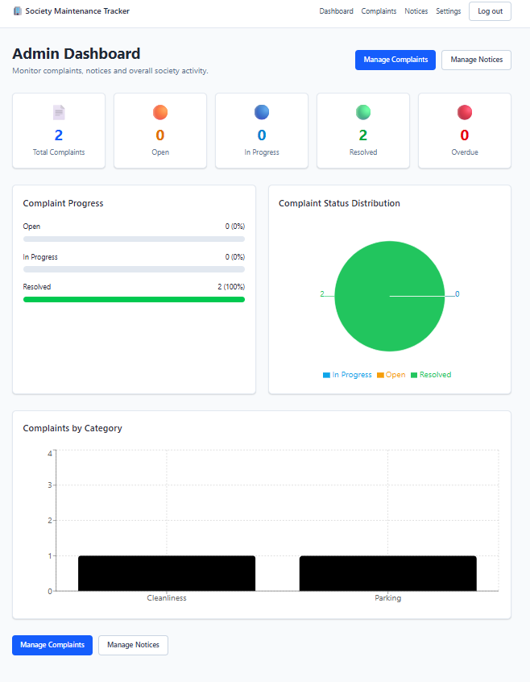
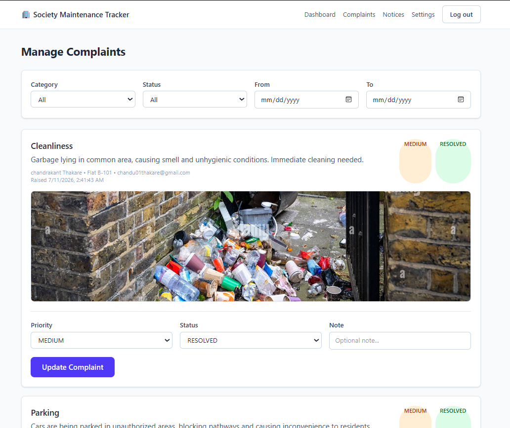
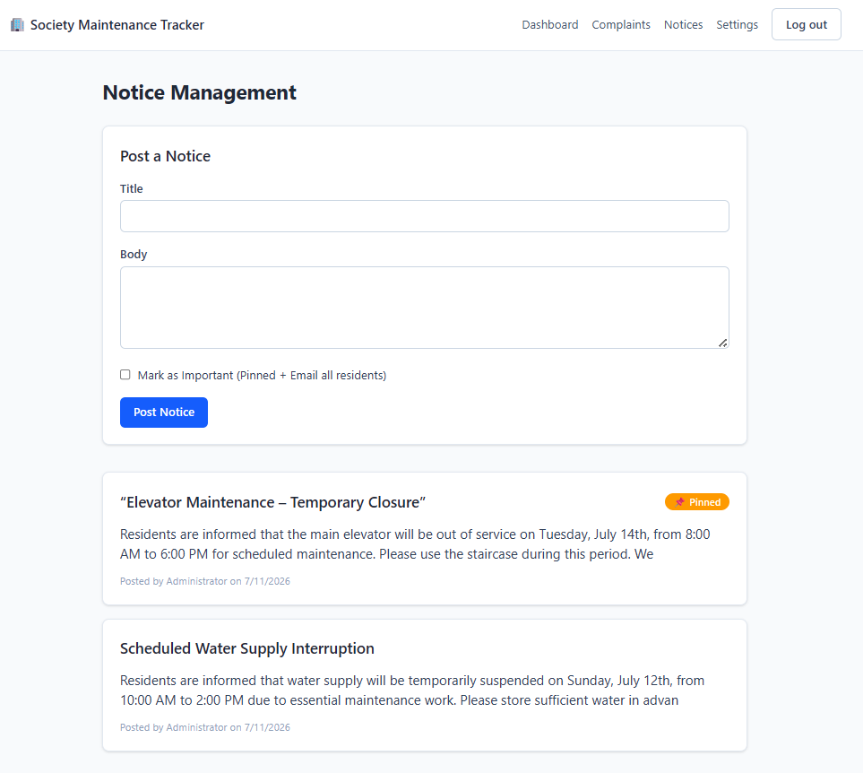

# 🏢 Society Maintenance Tracker

A full-stack Society Maintenance Tracker built with **Next.js 16**, **TypeScript**, **Prisma**, and **MySQL** that enables residents to raise maintenance complaints while allowing administrators to manage complaints, publish notices, and monitor society activities through an interactive dashboard.


 


## 📖 Overview

Managing maintenance requests in residential societies is often a manual and time-consuming process.

Society Maintenance Tracker digitizes the entire workflow by providing:

- Resident complaint submission with photo upload
- Complaint status tracking
- Complete complaint history
- Admin complaint management
- Society-wide notice board
- Email notifications
- Analytics dashboard
- Secure JWT authentication

The project demonstrates a production-style full-stack architecture using modern web technologies.


## ✨ Features

### 👤 Resident

- Register/Login
- Raise maintenance complaints
- Upload complaint photos
- Track complaint status
- View complaint history
- View society notices
- Dashboard with complaint statistics

### 👨‍💼 Admin

- Secure admin login
- Dashboard analytics
- Manage complaints
- Update complaint priority
- Update complaint status
- Complaint history tracking
- Publish society notices
- Mark notices as Important
- Automatic email notifications

### 📧 Email

- Complaint status update emails
- Important notice broadcast emails
- Gmail SMTP integration

### 🔒 Security

- JWT Authentication
- Password hashing
- Route protection
- Role-based authorization


## 🛠 Tech Stack

### Frontend

- Next.js 16
- React
- TypeScript
- Tailwind CSS

### Backend

- Next.js API Routes
- Prisma ORM
- MySQL

### Authentication

- JWT
- bcrypt

### Email

- Nodemailer
- Gmail SMTP

### Charts

- Recharts

### Deployment

- Vercel


## 📸 Screenshots

### Resident Dashboard



---

### Admin Dashboard



---

### Complaint Details



---

### Notice Board

 


## 📂 Project Structure

```text
app/
│
├── admin/
├── resident/
├── notices/
├── api/
│
components/
│
lib/
│
prisma/
│
public/
│
middleware.ts
```


## 🗄 Database Schema

### User

- id
- name
- email
- passwordHash
- role
- flatNumber

↓

### Complaint

- category
- description
- priority
- currentStatus
- photoUrl
- resolvedAt

↓

### ComplaintHistory

- complaint
- actor
- status
- note

↓

### Notice

- title
- body
- important
- createdBy


## ⚙️ Installation

Clone the repository

```bash
git clone https://github.com/chandu5t/society-maintenance-tracker.git
```

Move into the project

```bash
cd society-maintenance-tracker
```

Install dependencies

```bash
npm install
```

Generate Prisma Client

```bash
npx prisma generate
```

Run migrations

```bash
npx prisma migrate dev
```

Seed database

```bash
npx prisma db seed
```

Start development server

```bash
npm run dev
```

Visit

```
http://localhost:3000
```


## 🔐 Environment Variables

Create a `.env` file in the root directory.

Refer to `.env.example`. 


## 🔌 API Endpoints

### Authentication

POST /api/auth/register

POST /api/auth/login

POST /api/auth/logout

GET /api/auth/me

---

### Complaints

GET /api/complaints

POST /api/complaints

GET /api/complaints/:id

PATCH /api/complaints/:id/status

---

### Notices

GET /api/notices

POST /api/notices

---

### Dashboard

GET /api/dashboard

---

### Settings

GET /api/settings

PATCH /api/settings


## 🚀 Future Scope

- Push Notifications
- WhatsApp Integration
- Complaint Assignment
- Mobile Application
- Analytics Reports
- OCR-based Complaint Detection


## 👨‍💻 Author

**Chandrakant Thakare**

B.Tech Computer Science (Artificial Intelligence)

Vishwakarma Institute of Information Technology, Pune

GitHub:
https://github.com/chandu5t

LinkedIn:
https://www.linkedin.com/in/chandrakant-thakare-89994728b
